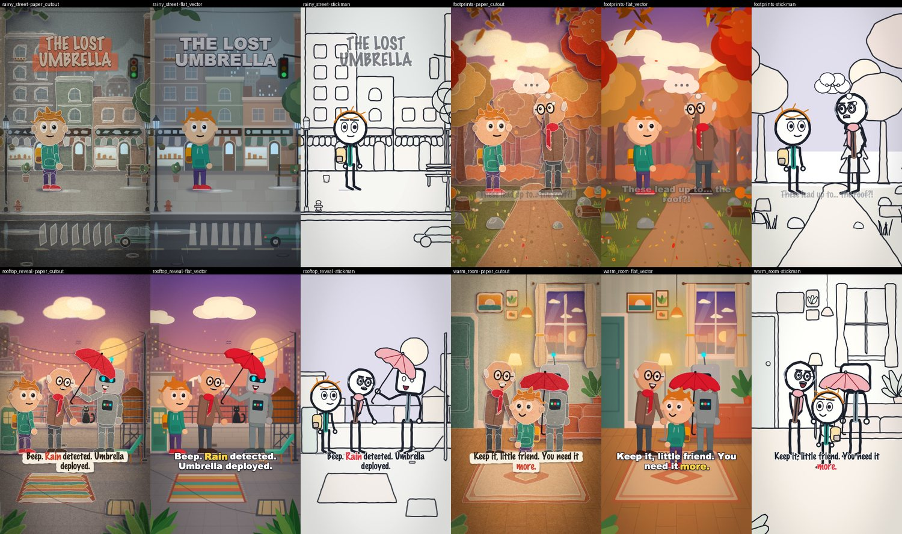
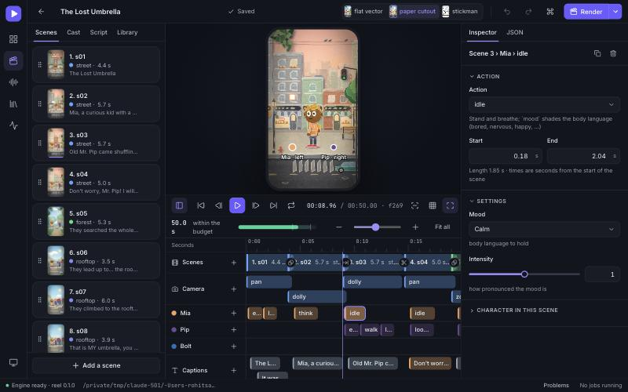

# reel

**Script → JSON scene spec → 45-60 s vertical reel (1080×1920, 30 fps, H.264 MP4), offline by default.**

`reel` is a template-driven 2D animation renderer. You describe a reel as JSON (characters, scenes,
actions, camera, captions, sound effects); the renderer — skia for drawing, ffmpeg for encoding, no network —
turns it into a video with parallax, depth of field, film grain, kinetic captions and sound.
Optionally an LLM (any local or hosted model, behind a swappable client) writes that JSON from a plain-text script,
but **the renderer never needs it**: `reel render spec.json` works from a file you wrote yourself.



*One spec, four scenes, three styles: only `--style` changes.*

```
script.txt ─► SpecGenerator ─► spec.json ─► reel lint ─► reel render ─► reel.mp4
             (LLM | manual | offline        (precise     (deterministic, cached,
              heuristic)                     reports)     parallel)
```

* **Three style packs render the same spec unchanged:** `paper_cutout` (layered paper, drop shadows, stop-motion wobble,
  page-flip transitions), `stickman` (marker line art on a whiteboard, squash-and-stretch), `flat_vector` (clean shapes, bold palette).
  Switch with `--style`; the spec never changes.
* **16 starter actions on a composable rig** (idle, walk, run, jump, wave, point, talk, laugh, cry, think, fall, pick_up, enter_from,
  exit_to, look_at, surprise) with anticipation, follow-through, hold frames, IK and secondary motion. Adding one takes five minutes
  ([guide](docs/adding-an-action.md)).
* **Cinematic polish:** parallax depth planes, easing camera (pan/zoom/dolly/handheld shake/rack focus), film grain, vignette,
  colour grade, bloom, chromatic aberration, optional letterbox; crossfade / wipe / page-flip transitions and a match-cut helper.
* **Offline audio:** local TTS (piper, or macOS `say` with a different voice per character), ~40 procedural SFX and a generated music
  bed with ducking, mixed to -16 LUFS; captions are retimed to the speech and drive the lip-flap. Optionally ElevenLabs
  voices (your key, opt-in, every line paid for once and cached).
* **Deterministic and fast to iterate:** same spec + seed ⇒ byte-identical MP4; a frame/segment cache means editing one
  caption re-renders ~2 s, not the whole reel.
* **Any script:** Hindi and other Indic scripts, Arabic, CJK and emoji captions are shaped properly (HarfBuzz) with system fallback fonts, and the
  voice-over follows the language when the machine has a voice for it.
* **An asset library for everything else:** a script that mentions a village, a rickshaw or a dragon is not stuck with the engine's
  own sets and people: ~110 built-in characters, objects and places (English, Hindi and Hinglish names), and you drop in your own SVG, PNG or JPG
  (a plain background is removed for you). The planners see them, all three styles draw them, and a script that needs something the library
  lacks is told so, with a button to add it ([docs/assets.md](docs/assets.md)).
* **Lint, don't crash:** `reel lint` reports exactly what is missing from the registry so you can add it.

## Install

Requires Python 3.11+ and `ffmpeg` (with libx264) on `PATH`.

```bash
git clone <this repo> && cd reel
make setup                      # = uv venv --python 3.12 .venv && uv pip install -e ".[dev]"
# without uv:  python3 -m venv .venv && .venv/bin/pip install -e ".[dev]"
.venv/bin/reel doctor           # checks ffmpeg, skia, fonts, speech engines, local LLMs
```

Optional extras: `uv pip install -e ".[tts]"` for the `piper-tts` Python package (the `piper` CLI also works).
Nothing is downloaded at runtime; fonts come from the system (override with `REEL_FONT_DIR`).

## Quickstart

```bash
reel lint examples/story_50s.json                     # validate (schema, registry, params, timing, 45-60 s budget)
reel render examples/story_50s.json --preview         # 360x640 fast preview → out/story_50s_preview.mp4
reel render examples/story_50s.json -o reel.mp4       # full 1080x1920
reel render examples/story_50s.json --style stickman  # same spec, different look
reel storyboard examples/story_50s.json               # HTML contact sheet (key frames per scene + lint)

# from a plain-text script (examples/scripts/): offline planner by default, or any LLM
reel build examples/scripts/why_we_sleep.txt --style paper_cutout -o reel.mp4 --preview
reel build examples/scripts/lost_umbrella.txt --llm ollama:llama3.1      # model-written spec (local Ollama)
reel build script.txt --spec-only                     # just write + lint the JSON, edit it, then `reel render`
```

### Using your own OpenAI or Claude key (optional)

The renderer never needs a model; this only upgrades the *script → JSON* step. Put the key in your shell (or in a git-ignored `.env`, see
[`.env.example`](.env.example)), never in the repository:

```bash
export OPENAI_API_KEY=sk-...             # or ANTHROPIC_API_KEY=sk-ant-...
reel doctor --llm openai                 # ONE tiny request: checks key + model + network (a fraction of a cent)
reel build script.txt --llm openai       # = openai:gpt-4o-mini; any model: --llm openai:gpt-4o
reel build script.txt --llm claude       # = anthropic:claude-sonnet-5-5; any model: --llm claude:<model-id>
export REEL_LLM=openai                   # make it the default of `reel build`
```

Only the script text is sent to the provider (about 6K tokens in, 4K out per attempt: roughly half a cent on a small model, a few cents on a large
one; check your provider's pricing). Everything after that, rendering included, stays on your machine. Details: [docs/llm.md](docs/llm.md).

### Using your ElevenLabs key for the voices (optional)

The default voices are offline (Piper if you installed it, macOS `say`, else a placeholder). For natural speech in many languages, with exact word timing for the
caption highlight, use ElevenLabs. It is **opt-in** (`--tts auto` never picks it) because it sends the spoken lines to ElevenLabs and uses your credits:

```bash
export ELEVENLABS_API_KEY=...                  # shell or a git-ignored .env: never a spec, a commit or a chat
reel doctor --tts elevenlabs                   # key, plan, credits left, model, voices; synthesises nothing, spends nothing
reel voices --tts elevenlabs                   # names + ids to use as characters[].voice
reel build script.txt --tts elevenlabs -o reel.mp4
export REEL_TTS=elevenlabs                     # optional: make it the default engine
```

Every line is paid for once: clips are cached by (model, voice, text), so re-renders and edits elsewhere cost nothing. Details and settings: [docs/audio.md](docs/audio.md#elevenlabs-optional-online).

## The CLI

| command | what it does |
|---|---|
| `reel build script.txt --style S -o reel.mp4` | script → JSON (LLM via `--llm ollama:llama3.1` / `openai:...` / `anthropic:...`, or the offline planner) → lint → render; the captions keep the script's own words unless you pass `--condense` |
| `reel render spec.json [--style S] [--preview] [--range 0:3] [--frames-dir D] [--lenient] [--crf N] [--maxrate 10M] [--tts ENGINE] [--no-audio]` | render a spec; `--preview` is low-res and lenient |
| `reel lint spec.json [--json] [--strict]` | schema + registry + params + timing; lists what is missing so it can be added |
| `reel list actions\|styles\|backgrounds\|transitions\|camera\|captions\|archetypes\|props\|sfx\|easings [-v]` | what is registered |
| `reel new-action NAME` / `reel new-style NAME` | scaffold an action file / a style folder |
| `reel schema [--enums\|--check]` · `reel manifest` · `reel reference` · `reel prompt [--compact] [--schema]` | JSON Schema, the template catalog the LLM reads, generated reference docs, the exact script → JSON prompt |
| `reel debug-actions A B -o sheet.png` · `reel debug-backgrounds T -o sheet.png` | contact sheets to check motion / sets without a full render |
| `reel storyboard spec.json` · `reel match-cut spec.json A B CHAR` | HTML storyboard; make a hard cut match position/size/framing |
| `reel assets list\|add\|remove\|check\|preview\|coverage\|fill` | the [asset library](docs/assets.md): see it, add your own picture (`add FILE --kind character --name dragon`), check it, draw a contact sheet in the three styles, say which things a script needs that the library lacks (`coverage script.txt`), swap a newly added asset into a spec that was planned without it (`fill spec.json`) |
| `reel cache stats\|clear [frames\|segments\|tts]` · `reel doctor [--llm M] [--tts elevenlabs]` · `reel voices [--tts E]` | housekeeping; `doctor` shows which TTS engines and local LLMs are usable (and can check a hosted model or ElevenLabs against your key); `voices` lists an engine's voices |

`reel serve [--open] [--port N] [--workspace DIR]` starts [Reel Studio](docs/ui.md), the web app (the brief it was built from is [docs/ui-prompt.md](docs/ui-prompt.md)).

Every command accepts `--plugin PATH` (a module, `.py` file or folder) or `REEL_PLUGINS=PATH` to load extra actions, styles,
backgrounds or SFX without touching the package, and `--assets DIR` or `REEL_ASSETS=DIR` for a folder of your own characters, objects and places
(an `assets/` folder next to the spec is always read; see [docs/assets.md](docs/assets.md)).

## A spec in 60 seconds

```json
{
  "meta": { "title": "Hello", "style": "paper_cutout", "seed": 7, "target_duration_sec": 50 },
  "characters": [ { "id": "mia", "archetype": "kid", "props": ["backpack"] } ],
  "scenes": [ {
      "id": "intro", "duration_sec": 5.5,
      "background": { "template": "street", "params": { "time_of_day": "dusk", "mood": "warm" } },
      "camera": { "moves": [ { "type": "dolly", "from": 0, "to": 0.25, "t0": 0, "t1": 5.5, "ease": "ease_in_out" } ] },
      "layers": [ { "character": "mia", "position": [0.34, 0.70],
                    "actions": [ { "name": "enter_from", "t0": 0.4, "t1": 2.2, "params": { "side": "left" } } ] } ],
      "captions": [ { "text": "Rainy days are for adventures!", "t0": 3.1, "t1": 5.2, "style": "subtitle", "speaker": "mia" } ],
      "sfx": [ { "name": "chime", "t": 3.1 } ],
      "transition_out": { "type": "crossfade", "duration": 0.6 }
  } ]
}
```

One scene is only 5.5 s, so `reel lint` reports the 45-60 s budget as an error; add `--no-duration-check` while experimenting (a real reel
needs scenes that add up to 45-60 s once transition overlaps are subtracted).

## Reel Studio (the web app)

```bash
reel serve --open        # or: make serve
```



Write or paste a script, get a first cut that says what the script says (or skip the script and **build the reel by hand**, scene by scene, picking backgrounds, characters, objects, actions, sounds and words from the library), edit it on a timeline with a live preview that plays **with the voice**, export the MP4. It is a
local app over the same engine (127.0.0.1, behind a per-launch access token; the built app is committed, so no Node is
needed): projects are plain `*.reel.json` files, the preview is the real renderer, a render runs as a cancellable job.
An online planner or voice (OpenAI, Claude, ElevenLabs) is used only when you pick it and click through a dialog that names the
host and the cost; the app never asks for, shows or stores an API key. [docs/ui.md](docs/ui.md) covers the screens,
architecture, API and security model.

Full reference: [docs/spec.md](docs/spec.md) · two complete examples: [`examples/story_50s.json`](examples/story_50s.json) (a 50 s story) and
[`examples/explainer_45s.json`](examples/explainer_45s.json) (a 45 s explainer).

## Docs

| | |
|---|---|
| [Architecture](docs/architecture.md) | the two stages, "templates describe, styles render", rendering, cache, determinism |
| [The scene spec](docs/spec.md) | every field, conventions, every lint code |
| [Add an action in 5 minutes](docs/adding-an-action.md) | PR-style walkthrough (the `shrug` plugin) |
| [Add a style](docs/adding-a-style.md) · [Add a background](docs/adding-a-background.md) | one folder + a decorator |
| [The asset library](docs/assets.md) | characters, objects and places from SVG/PNG/JPG: using them, adding your own, drawing them so they look right, how scripts find them |
| [Audio](docs/audio.md) · [Script → JSON](docs/llm.md) | TTS/SFX/music/mix; the LLM stage, its clients and repair loop; the exact prompts are in [docs/prompts/](docs/prompts/full.txt) |
| [Reel Studio](docs/ui.md) | the web app: screens, architecture, API, security, accessibility, developing it |
| [Performance & caching](docs/performance.md) | what is cached, segment keys, tuning |
| [Generated reference](docs/reference/README.md) | actions, backgrounds, styles, channels, sfx, ... (from the live registries) |

## Development

```bash
make smoke        # the whole path once (~40 s): doctor, lint + preview both examples, build a video from a script
make test         # full suite (renders real frames; golden-frame test per style)
make check        # ruff + mypy + tests
make generated    # regenerate schema/, the template manifest, docs/reference and docs/prompts after changing registries
make ui-check     # the web app: type check + tests + production build (needs Node 20+; `make ui-install` first)
pre-commit install
```

Golden frames live in `tests/golden/`; refresh deliberately with `REEL_UPDATE_GOLDEN=1 pytest -k golden` after an intended
visual change. They include captions, so they are tied to the fonts they were recorded with (`tests/golden/fonts.json`: Impact, Arial Black,
Marker Felt on macOS); on a machine that resolves other fonts the golden test skips itself and says how to re-record.

`tests/` also checks schema validation, the duration budget, the action registry (every action × every parameter choice), every
background template (every time of day × mood, deterministic, covers the stage, renders in all styles), determinism (byte-identical MP4 for any
worker count, with audio), the frame/segment cache, lenient fallbacks, the audio mix, the LLM stage against scripted clients (no network), the
two shipped examples in all styles, and the CLI.

## Layout

```
src/reel/{core,styles,actions,templates,audio,llm,cli}/   see docs/architecture.md
src/reel/server/   Reel Studio's API (FastAPI) · static/ is the committed production build of ui/
ui/          Reel Studio's source (React + TypeScript + Vite), see docs/ui.md
examples/    story_50s.json · explainer_45s.json · scripts · plugins/shrug.py
schema/      scene_spec.schema.json (generated)
tests/       unit + golden-frame tests
docs/        guides + generated reference (docs/reference) + the exact LLM prompts (docs/prompts)
```
