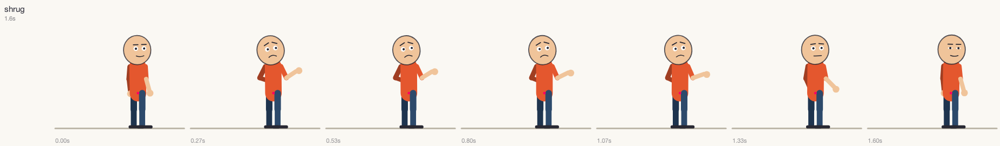

# How to add an action in 5 minutes

*A PR-style walkthrough: we add `shrug` ("who knows?"). The finished file is
[`examples/plugins/shrug.py`](../examples/plugins/shrug.py) and it runs as shipped.*

An action is one function, `fn(ctx, params) -> Clip`, registered with a decorator. It describes
**motion only** - per-channel curves over time - and knows nothing about how a style draws it, so it
works in `flat_vector`, `paper_cutout`, `stickman` and any style someone adds later.

---

## 1 · Scaffold (30 s)

```bash
reel new-action shrug --category expression --dir examples/plugins
```

```
created examples/plugins/shrug.py

next:
  1. edit shrug.py: the keyframes in the body are a worked example
  2. preview it:   reel debug-actions shrug --out shrug_sheet.png --plugin examples/plugins
  3. use it:       "actions": [{"name": "shrug", "t0": 1.0, "t1": 2.5}]
```

Inside the source checkout, omit `--dir` and the file is created in `src/reel/actions/` (every module
there is auto-registered). Anywhere else the file is a **plugin**: load it with `--plugin PATH` or
`export REEL_PLUGINS=PATH` - no change to the package.

## 2 · Describe the motion (2 min)

```python
class ShrugParams(ParamsBase):                     # what a spec may put in "params" (strict: typos are lint errors)
    intensity: float = Field(1.0, ge=0.3, le=1.6, description="how exaggerated the shrug is")
    hold: float = Field(0.6, ge=0.0, le=2.0, description="seconds the shoulders stay up (the comedic hold)")


@register_action("shrug", params_schema=ShrugParams, category="expression",
                 summary="'Who knows?': shoulders up, palms out, head tilt, a comedic hold, then drop",
                 min_duration=0.8, default_duration=1.6)
def shrug(ctx: ActionContext, p: ShrugParams) -> Clip:
    D, k = ctx.duration, p.intensity              # the action stretches to whatever window the spec gives it
    up = min(0.28, 0.25 * D)                      # time to reach the pose
    drop = max(up, D - min(0.35, 0.25 * D))       # when the release starts
    top = min(drop, up + p.hold)                  # end of the hold
    c = ctx.clip(blend_in=0.1, blend_out=0.25)    # how it cross-fades with whatever came before/after

    c.key("bob", [(0, 0), (0.06 * D, -6), (up, 11 * k, "overshoot"), (top, 9 * k), (D, 0)], mode="add")
    for s, sg in (("r", 1), ("l", -1)):           # both arms: elbows bent, palms turned out
        c.key(f"arm_{s}_sh", [(0, 5 * sg), (0.06 * D, 2 * sg), (up, 26 * sg * k, "overshoot"), (top, 24 * sg * k), (D, 5 * sg)])
        c.key(f"arm_{s}_el", [(0, 10), (up, 98 * k, "overshoot"), (top, 92 * k), (D, 10)])
        c.key(f"hand_{s}_wr", [(0, 0), (up, -38 * sg * k), (top, -32 * sg * k), (D, 0)])
    c.key("head_tilt", [(0, 0), (up, -9 * k), (top, -8 * k), (D, 0)])
    c.key("brow_raise", [(0, 0), (up, 0.7 * k), (top, 0.7 * k), (D, 0)])
    c.key("mouth_smile", [(0, 0.3), (up, -0.55), (top, -0.55), (D, 0.3)])
    c.event(up, "shrug")                          # optional marker (auto-SFX can map it to a sound)
    return c
```

The rules that matter:

* **Channels** are the rig's degrees of freedom - `arm_r_sh`, `torso_lean`, `mouth_open`, `brow_raise`, ...
  ([reference/channels.md](reference/channels.md)). Angles are degrees: `0` = limb hangs down, `+90` = pointing
  forward. A typo gets a "did you mean" error *at authoring time*.
* **Keyframes** are `(seconds, value[, easing])`; the easing shapes the segment *arriving* at that key
  (`overshoot`, `bounce`, `ease_in_out`, `anticipate`, `hold`, ... - [reference/easings.md](reference/easings.md)).
* **Motion principles are just keyframes**: a small *anticipation* dip before the move (`0.06 * D, -6`),
  *overshoot* easing for follow-through, and a *hold* (two equal keys) for comedy timing.
* `mode="add"` layers a curve on top of whatever is below (the idle breathing, a walk) instead of
  replacing it; `c.osc(...)` adds sinusoids; `c.prop(...)` moves props; `c.move_root(...)` moves the
  character (and set `moves_root=True` in the decorator so the linter can warn about overlaps).
* To put a hand on a body part use IK, not guessed angles: `ctx.rig.reach(pose, "r", "chin")` returns the
  `arm_r_sh`/`arm_r_el` that bring the wrist there, correct for every archetype.

## 3 · Preview it, no style needed (30 s)

```bash
reel debug-actions shrug --plugin examples/plugins -o shrug_sheet.png
```



One column per sampled moment. (`reel list actions --plugin examples/plugins` shows it next to the starters.)

## 4 · Use it (30 s)

```json
{ "character": "ana", "position": "center",
  "actions": [ { "name": "shrug", "t0": 1.0, "t1": 2.6, "params": { "hold": 0.8 } } ] }
```

```bash
reel lint spec.json --plugin examples/plugins           # checks name, params, timing
reel render spec.json --preview --plugin examples/plugins
```

* A typo in a param is reported with the exact path and the allowed names:
  `scenes[0].layers[0].actions[0].params.holdd: unknown param 'holdd' for action 'shrug' -> did you mean 'hold'?`
* A spec that names an action nobody registered gets the **missing-from-the-registry** report (with
  `reel new-action <name>` as the fix). With `--lenient` (and in `--preview`) the renderer falls back to
  `idle` with a warning so previews still render.

## 5 · Test it (1 min)

```python
def test_shrug_pose(clean_registry):
    CATALOG.load_plugins(["examples/plugins"])
    baked, t0, t1 = bake_action("shrug")                       # reel.core.debug: the action alone on a timeline
    mid = baked.pose(baked.frame_index((t0 + t1) / 2))
    assert mid["arm_r_el"] > 60 and mid["head_tilt"] < -4
```

`tests/test_actions.py` already runs *every* registered action for finiteness, channel limits, very short
and very long windows and strict params - a new action is covered the moment it registers.

## 6 · Ship it

1. Move the file to `src/reel/actions/shrug.py` (or keep it as a plugin).
2. `reel manifest -o src/reel/templates/manifest.json && reel schema -o schema/scene_spec.schema.json`
   (the LLM prompt reads the manifest, so it can now pick `shrug`; `pytest` fails if these are stale).
3. `reel reference -o docs/reference` to refresh the generated docs; `pytest`; open the PR.

### PR checklist

- [ ] params model has defaults, bounds and `description=` on every field
- [ ] `summary`, `min_duration` and `default_duration` set (shown by `reel list` and given to the LLM)
- [ ] anticipation / overshoot / hold used where it helps
- [ ] works at `0.35 s` and `6 s` (`tests/test_actions.py` checks)
- [ ] a one-line preview image or sheet in the PR description (`reel debug-actions`)
